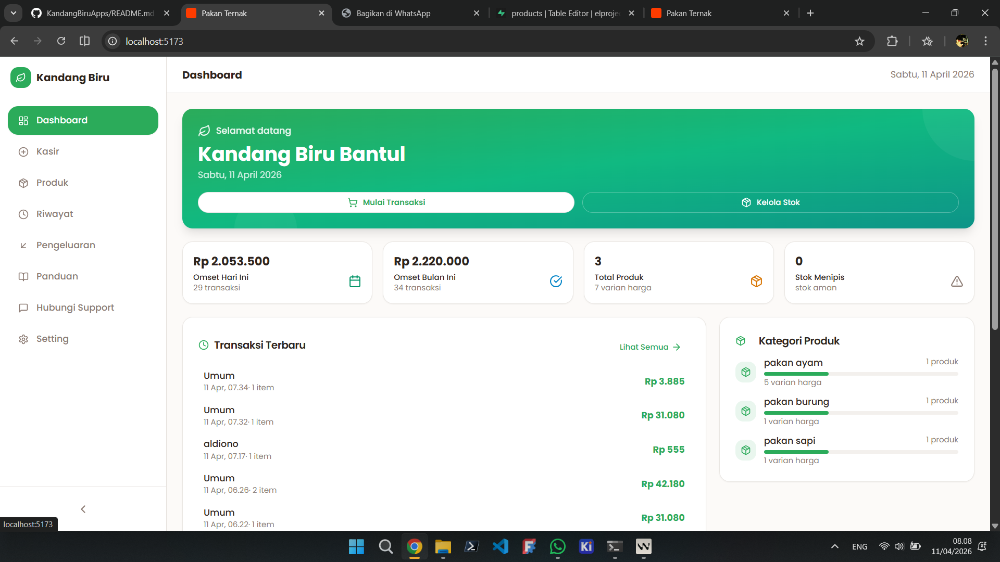
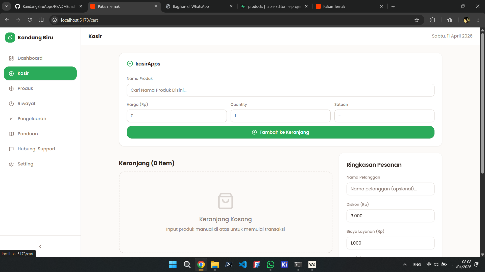
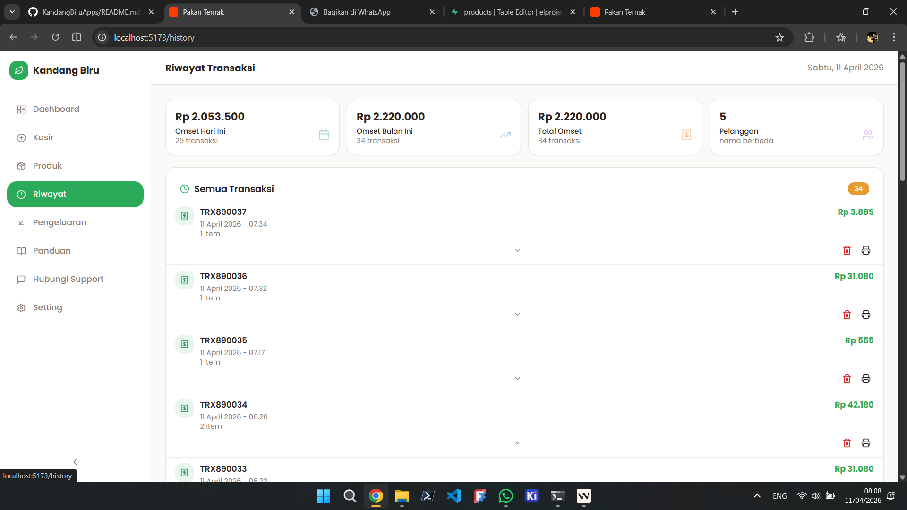
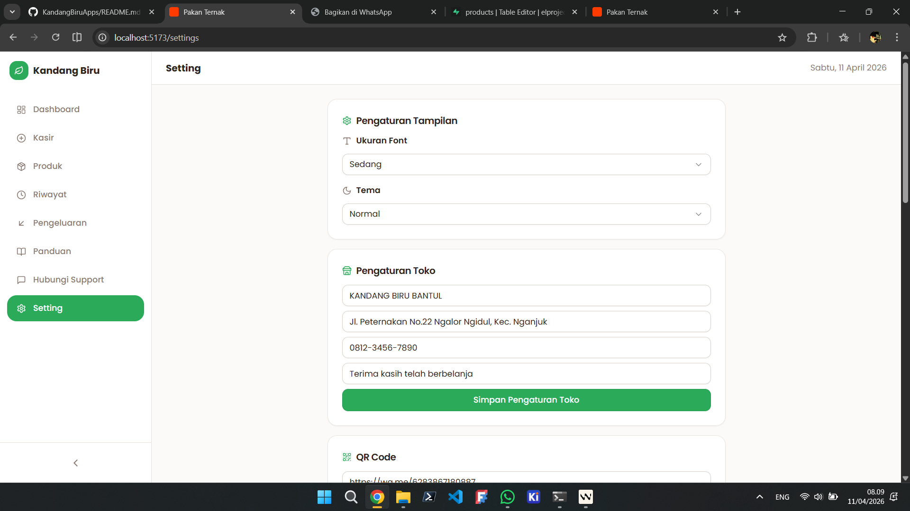
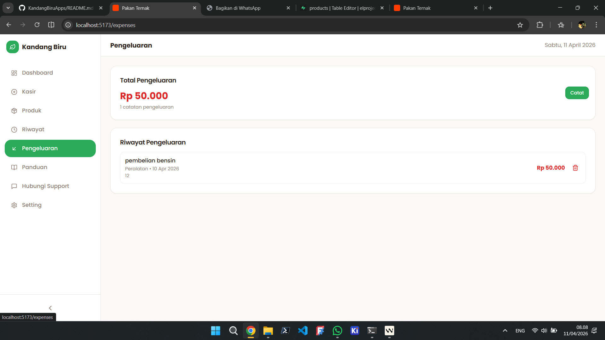
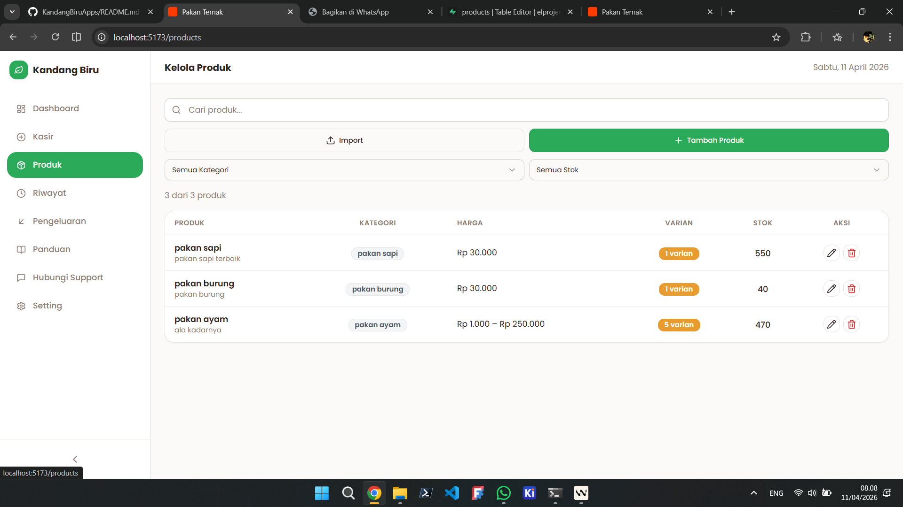
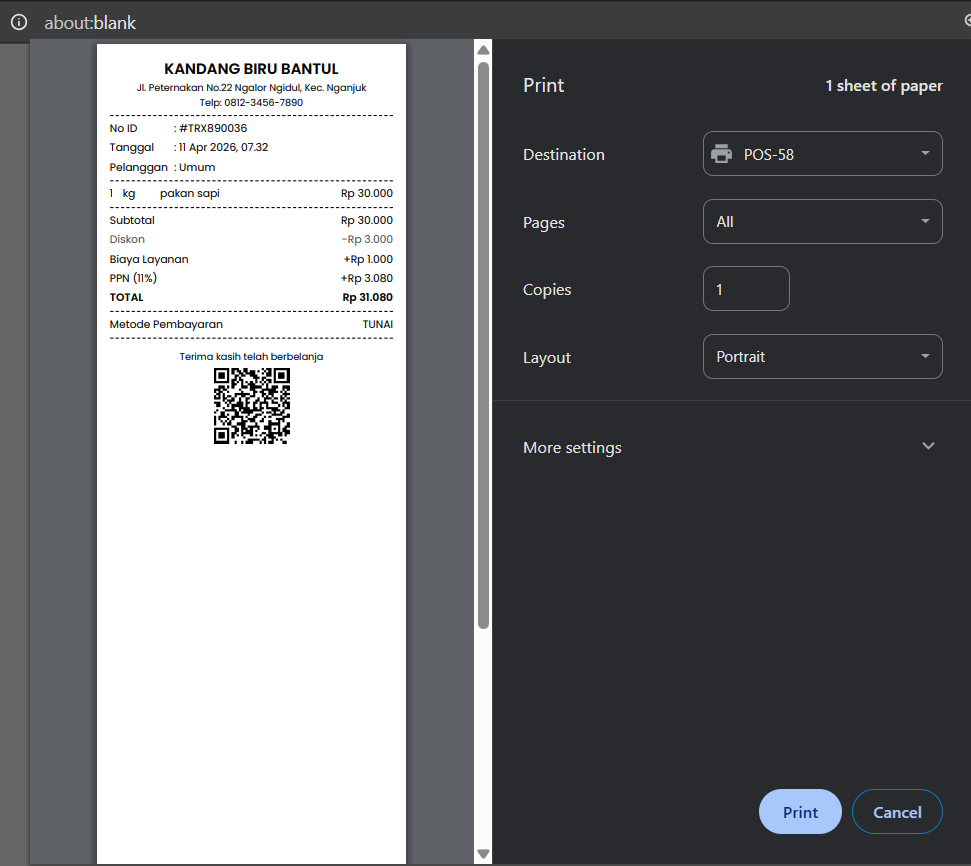

# KandangBiru Apps

Aplikasi mobile manajemen toko pakan ternak dengan fitur lengkap untuk penjualan, cetak struk, dan manajemen inventaris.

## 🚀 Teknologi

- **React 18** - UI Library
- **Vite** - Build tool & development server
- **TypeScript** - Type safety
- **TailwindCSS** - Styling
- **Radix UI** - Komponen UI accessible
- **Capacitor** - Mobile app framework (Android)
- **Supabase** - Backend & Database
- **Wouter** - Routing
- **React Hook Form** - Form management
- **Zod** - Schema validation
- **TanStack Query** - Data fetching & caching
- **ExcelJS** - Export Excel
- **@capgo/capacitor-printer** - Print struk thermal printer

## 📋 Fitur

- ✅ Manajemen produk dan kategori
- ✅ Keranjang belanja (Cart)
- ✅ Cetak struk thermal printer (58mm)
- ✅ Riwayat transaksi
- ✅ Manajemen pengeluaran
- ✅ Dashboard dengan statistik
- ✅ Export data ke Excel
- ✅ Pencarian dan filter produk
- ✅ Responsive design untuk mobile

## 📸 Screenshots

Berikut adalah tampilan aplikasi KandangBiru:

<div align="center">
  
  
  
  
  
  
</div>

**Cara menambahkan screenshot:**
1. Buat folder `screenshots` di root project
2. Ambil screenshot dari device atau emulator
3. Simpan gambar dengan nama yang deskriptif (misal: `dashboard.png`, `cart.png`)
4. Update section ini dengan path gambar yang sesuai

## 🛠️ Prerequisites

Sebelum memulai, pastikan Anda sudah menginstall:

- **Node.js** (v18 atau lebih tinggi)
- **pnpm** - Package manager (install dengan `npm install -g pnpm`)
- **Java JDK** (v21 atau lebih tinggi) - untuk build Android
- **Android Studio** - untuk build APK
- **Git**

## 📦 Installation

1. Clone repository:
```bash
git clone https://github.com/elproject-dev/KandangBiruApps.git
cd mobile
```

2. Install dependencies:
```bash
pnpm install
```

3. Setup Supabase:
- Buat project baru di [Supabase](https://supabase.com)
- Jalankan SQL migration dari file `supabase-setup.sql`
- Update konfigurasi Supabase di `src/lib/supabase-store.ts`

## 🚀 Development

### Jalankan Development Server (Web)
```bash
pnpm dev
```
Akses di http://localhost:5173

### Build untuk Production
```bash
pnpm build
```

### Sync ke Android
```bash
pnpm cap sync android
```

### Build APK Android
```bash
cd android
./gradlew assembleDebug
```

APK akan tersedia di `android/app/build/outputs/apk/debug/app-debug.apk`

### Install ke Device (via ADB)
```bash
adb install android/app/build/outputs/apk/debug/app-debug.apk
```

## 📱 Konfigurasi Printer

Aplikasi menggunakan printer thermal dengan ukuran kertas 58mm. Konfigurasi cetak dapat diatur di `src/lib/print.ts`:

- **Ukuran kertas**: 70mm
- **Font**: Poppins
- **Line-height**: 1.6
- **Font-size**: 11px (body), 10px (table)

## 🗂️ Struktur Project

```
mobile/
├── android/              # Konfigurasi Android native
├── public/               # Static assets
├── src/
│   ├── components/       # Komponen React
│   │   └── ui/          # Komponen UI (Radix UI)
│   ├── hooks/           # Custom hooks
│   ├── lib/             # Utilities & helpers
│   │   ├── cart-context.tsx
│   │   ├── print.ts     # Template cetak struk
│   │   └── supabase-store.ts
│   ├── pages/           # Halaman aplikasi
│   │   ├── cart.tsx
│   │   ├── dashboard.tsx
│   │   ├── expenses.tsx
│   │   └── history.tsx
│   ├── App.tsx          # Main app component
│   ├── main.tsx         # Entry point
│   └── index.css        # Global styles
├── capacitor.config.json # Konfigurasi Capacitor
├── package.json
├── tailwind.config.js
└── tsconfig.json
```

## 📝 Scripts

| Command | Deskripsi |
|---------|-----------|
| `pnpm dev` | Jalankan development server |
| `pnpm build` | Build untuk production |
| `pnpm serve` | Preview build production |
| `pnpm typecheck` | Cek TypeScript |
| `pnpm cap sync android` | Sync web assets ke Android |
| `pnpm cap open android` | Buka project di Android Studio |

## 🔧 Environment Variables

Buat file `.env` di root project:

```env
VITE_SUPABASE_URL=your_supabase_url
VITE_SUPABASE_ANON_KEY=your_supabase_anon_key
```

## 📄 License

MIT License

## 👨‍💻 Author

EL PROJECT DEVELOPMENT

